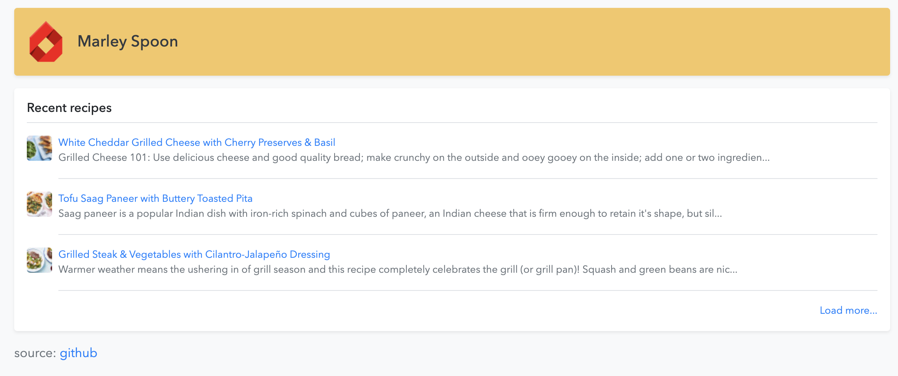

# Marley spoon web challenge 

[](https://travis-ci.org/delphist/marleyspoon-test)

## Overview

This is an application solving a simple [code challenge task](https://gist.github.com/lawitschka/063f2e28bd6993cac5f8b40b991ae899).

## Screenshot



## Implementation details

I've decided to use ruby on rails to increase development speed and to have an opportunity to add new features fast in the future. It's using grape and grape-entity gems to expose API, webpacker + vue.js for simple SPA application.

## Requirements

 - Ruby 2.7
 - Node.js 10+

## Installation

```
bundle install
yarn install
rails s
``` 
Then you can go to the http://localhost:3000/ to see the result.